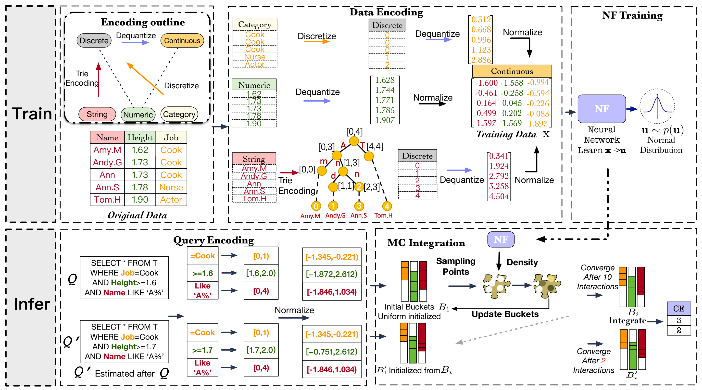

# FACE
This is a pytorch implementation for the VLDB 2022 paper [FACE: A Normalizing Flow based Cardinality Estimator](http://www.vldb.org/pvldb/vol15/p72-li.pdf) [[**Citation**]](#citation).
Our codes are built based on [nflows](https://pypi.org/project/nflows/) and [torchquad](https://github.com/esa/torchquad).


<p align="center">
    <br>
    
<p>


# Folder Structure

    .
    ├── torchquadMy     # A modified pytorch implementation of adaptive importance sampling.
    ├── utils           # A wrapper for datasets, used to generate queries, define error metrics, etc.
    ├── data            # A directory for storing data. Downloaded data can be stored here.
    ├── train           # Codes for training normalizing flow models.
    ├── evaluate        # Evaluate trained models on real-world datasets for cardinality estimation.
    ├── environment.yml # Configuration file used to build conda environment.
    └── README.md               


# Quick Start
The real-world datasets can be downloaded from [dataset link](https://cloud.tsinghua.edu.cn/d/a9f1323645a24bc5b987/).
We use power and BJAQ as concrete examples to illustrate how to use FACE for cardinality estimation.
- **Step 1:** Build conda environment with `conda env create -f environment.yml`.
- **Step 2:** Switch to the installed environment by `conda activate testenv`.
- **Step 3:** Install modified torchquad by `cd ./torchquadMy`, and then `pip install .` .
- **Step 4:** Download the datasets from [dataset link](https://cloud.tsinghua.edu.cn/d/a9f1323645a24bc5b987/), and then place the data into `data` directory.
- **Step 5:** After properly setting the paths of datasets, models, etc, 
you can use the notebook files under `train` and `evaluate` directories to conduct experiments.


**Notes:** 
- Before running the codes, make sure the variables related to data paths in the codes are set properly. 
We have added some comments to hint before some such variables, but may not have covered all of them.
- Current codes may be incompatible with machines that do not have GPUs.
- For GPUs with memory less than 2080Ti (11GB),
 some parameters need to be set smaller, which will bring some performance loss.

## License

The project is available under the [MIT](LICENSE) license.


## Citation
If our work is helpful to you, please cite our paper:
```bibtex
@article{DBLP:journals/pvldb/WangCLL21,
  author    = {Jiayi Wang and
               Chengliang Chai and
               Jiabin Liu and
               Guoliang Li},
  title     = {{FACE:} {A} Normalizing Flow based Cardinality Estimator},
  journal   = {Proc. {VLDB} Endow.},
  volume    = {15},
  number    = {1},
  pages     = {72--84},
  year      = {2021},
  url       = {http://www.vldb.org/pvldb/vol15/p72-li.pdf},
  doi       = {10.14778/3485450.3485458},
  timestamp = {Thu, 21 Apr 2022 17:09:21 +0200},
  biburl    = {https://dblp.org/rec/journals/pvldb/WangCLL21.bib},
  bibsource = {dblp computer science bibliography, https://dblp.org}
}
```